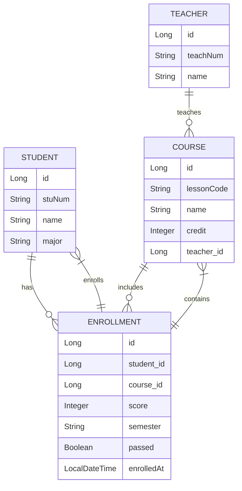

# EduTrack 教育管理系统


EduTrack 是一个基于 Spring Boot 的教育管理系统，用于管理学生、教师、课程以及选课信息。该系统提供了完整的 CRUD 操作和 RESTful API 接口。

## 功能特性

- 学生信息管理（增删改查）
- 教师信息管理（增删改查）
- 课程信息管理（增删改查）
- 选课记录管理（增删改查）
- RESTful API 设计
- 数据库自动建表与更新
- 数据唯一性校验（学号、教职工号、课程代码等）
- 关联查询（按学生/课程查询选课记录）
- 统一响应状态码和格式
- 多层次XSS攻击防护

## 技术栈

- **后端框架**: Spring Boot 4.0.0
- **编程语言**: Java 21
- **数据库**: PostgreSQL
- **ORM 框架**: Spring Data JPA
- **构建工具**: Maven
- **安全防护**: Apache Commons Text, 自定义XSS过滤器, HTML转义
- **其他**: Lombok, Spring Validation

## 系统架构

系统采用经典的分层架构模式：

```
controller (控制层) -> service (服务层) -> repository (数据访问层) -> entity (实体层)
```

主要实体包括：

- Student (学生)
- Teacher (教师)
- Course (课程)
- Enrollment (选课记录)

## 实体关系



## 快速开始

### 环境要求

- Java 21+
- Maven 3.6+
- PostgreSQL 15+

### 配置步骤

1. 克隆项目到本地：
   ```bash
   git clone <repository-url>
   ```

2. 创建 PostgreSQL 数据库：
   ```sql
   CREATE DATABASE edutrack;
   ```

3. 修改数据库配置：
   在 `src/main/resources/application.yml` 文件中修改数据库连接信息：
   ```yaml
   spring:
     datasource:
       url: jdbc:postgresql://localhost:5432/edutrack
       username: your_username
       password: your_password
   ```

4. 编译和运行项目：
   ```bash
   mvn clean install
   mvn spring-boot:run
   ```

### API 访问

项目启动后，可以通过以下地址访问：

- 应用程序: http://localhost:8080

## 安全特性

### XSS防护
系统通过多层次防护来防止XSS攻击：

1. **全局过滤器防护**：使用自定义的XSS过滤器拦截所有HTTP请求，自动清理参数中的恶意脚本
2. **实体层防护**：在实体类中使用@PrePersist和@PreUpdate注解，在数据持久化前自动清理
3. **传输层防护**：在DTO对象中提供cleanXss()方法，在数据传输过程中主动清理
4. **控制层防护**：在控制器中对路径变量和请求体进行二次验证和清理
5. **响应层防护**：在错误消息中使用HTML转义，防止恶意数据通过错误响应注入
6. **工具类防护**：使用Apache Commons Text进行HTML转义，并增强过滤常见攻击向量

### SQL注入防护
系统通过以下方式防止SQL注入攻击：
1. 使用Spring Data JPA和Hibernate ORM框架，参数化查询防止注入
2. 使用Spring Validation进行输入验证
3. 限制数据库用户权限，遵循最小权限原则

## API 响应格式

所有 API 响应都遵循统一的格式：

```json
{
  "code": 200,
  "message": "Success",
  "data": {}
}
```

状态码说明：
- 200: 请求成功
- 201: 创建成功
- 400: 请求参数错误
- 404: 资源未找到
- 409: 资源冲突（如重复数据）
- 500: 服务器内部错误

## API 接口说明

系统提供以下主要 RESTful API 接口：

### 学生管理

- `GET /students` - 获取所有学生
- `GET /students/{id}` - 根据ID获取学生
- `GET /students/num/{stuNum}` - 根据学号获取学生
- `POST /students` - 创建学生
- `PUT /students/{id}` - 更新学生信息
- `DELETE /students/{id}` - 删除学生

### 教师管理

- `GET /teachers` - 获取所有教师
- `GET /teachers/{id}` - 根据ID获取教师
- `GET /teachers/num/{teachNum}` - 根据教职工号获取教师
- `POST /teachers` - 创建教师
- `PUT /teachers/{id}` - 更新教师信息
- `DELETE /teachers/{id}` - 删除教师

### 课程管理

- `GET /courses` - 获取所有课程
- `GET /courses/{id}` - 根据ID获取课程
- `GET /courses/code/{lessonCode}` - 根据课程代码获取课程
- `POST /courses` - 创建课程
- `PUT /courses/{id}` - 更新课程信息
- `DELETE /courses/{id}` - 删除课程

### 选课管理

- `GET /enrollments` - 获取所有选课记录
- `GET /enrollments/{id}` - 根据ID获取选课记录
- `GET /enrollments/student/{studentId}` - 根据学生ID获取选课记录
- `GET /enrollments/course/{courseId}` - 根据课程ID获取选课记录
- `POST /enrollments` - 创建选课记录
- `PUT /enrollments/{id}` - 更新选课记录
- `DELETE /enrollments/{id}` - 删除选课记录

## 开发指南

### 项目结构

```
src/
├── main/
│   ├── java/
│   │   └── xyz/lukix/edutrack/
│   │       ├── EduTrackApplication.java    # 启动类
│   │       ├── config/                     # 配置文件
│   │       ├── controller/                 # 控制器层
│   │       ├── dto/                        # 数据传输对象
│   │       ├── entity/                     # 实体类
│   │       ├── repository/                 # 数据访问层
│   │       ├── service/                    # 服务层接口
│   │       ├── impl/                       # 服务层实现
│   │       └── util/                      # 工具类
│   └── resources/
│       ├── application.yml                 # 配置文件
│       └── static/docs/                    # 静态资源
└── test/                                   # 测试代码
```

### 数据库配置

项目使用 Hibernate 的 `ddl-auto: update` 模式，会在应用启动时自动创建和更新数据库表结构。

## 贡献

欢迎提交 Issue 和 Pull Request 来帮助改进这个项目。

## 许可证

本项目采用 MIT 许可证，详情请见 [LICENSE](LICENSE) 文件。